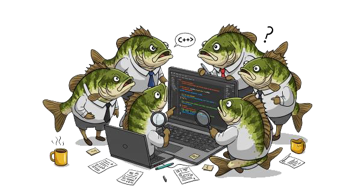

## :smiley: Hi there  ╰(*°▽°*)╯  

Welcome to my page!  
I am a <b>C++</b> programmer living in <b>Cheonan</b>, <b>Korea</b>.    
I mainly develop automation equipment used in semiconductor production lines. 
- Memory Test Handler 
- Logic IC Test Handler
- Secondary Battery Manufacturing Equipment
- Module Memory Test Handler
- Plasma Post-Process Equipment
- Various Other Automation and Measurement Equipment 

And I like fishing.

### :office: Main clients
- SAMSUNG, PSK, LT, TurboCATS, TSI, ITM, SOLID MECA, ...

### :hammer: Things I code with

  
  
  
  
  
  
  
  
  
 

### :email: Where to find me

  
   

 

 
Therefore, there is now no condemnation for those who are in Christ Jesus, 
because through Christ Jesus the law of the Spirit of life set me free from the law of sin and death.  
<i>그러므로 이제 그리스도 예수 안에 있는 자에게는 결코 정죄함이 없나니  
이는 그리스도 예수 안에 있는 생명의 성령의 법이 죄와 사망의 법에서 너를 해방하였음이라. 롬 8:1-2</i> 
